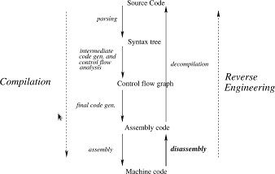

# Table of Contents

* [Build Instrcutions](docs/build.md)
* [About Static Disassembly](#About-static-disassembly) 

### About static disassembly 
    
- Undecidable
    
  1. R. N.  Horspool and N. Marovac. An approach to the problem of
  detranslation of computer programs. Comput. J., 23(3):223–229, 1980.  
                                        
  2. A. King, A.  Mycroft, T. W. Reps, and A. Simon.  Analysis of executables:
Benefits and challenges (dagstuhl seminar 12051).  Dagstuhl Reports, 2(1):100–
                                                                          116,
                                                                          2012.[read]()
  3. A.King, A.Mycroft, T. Reps, and A. Simon. Analysis of Executables: Benefits and Challenges. Dagstuhl Reports, pages 100–116, 2012. [read]()

### Nomenclature 

Reverse engineering consiste of  two phases: Disassembly (which produces
    assembly code from machine code) and Decompilation ( which reconstructs the
      higher-level semantic structure of the program from the assembly code) 
    

### Motivation for executable analysis 

Traditional Traditional source-code analysis frameworks have limited
applicability in several scenarios which can be eliminated by  executable-level
tools.  Some scenarios are:
- Absence of source-code There are several circumstances where the original
source-code is not accessible. Some of the most prevalent reasons are listed
below: 
  - IP-protected software 
  - Third-party library and software components
  - Malicious executables 
  - Legacy executables 

All such situations require executable-level tools for distinct applications.
For example, due to a rapid rise in cyber attacks, there is an increasing need
to certify the behavior and uncover vulnerabilities in IP-protected software
and commercial off-the shelf software components. The availability of such
components only in an executable form has created a huge demand for effective
executable analysis tools to achieve this goal Further, hundreds of malware are
being uncovered almost daily which are only available in executable form.
Security researchers requires novel tools to understand the behavior of such
malware and to develop effective counter strategies. Various organizations have
critical legacy applications that have been de- veloped for older systems and
need to be ported to future versions. In many cases, the application
source-code is no longer accessible requiring these applications to continue to
run on outdated configurations.  There is a huge demand of a framework which
can recover functionally correct source-code components from such legacy
software, so that such legacy systems can be ported to secure configurations.
Source-code

- Source-code analysis not sufficient 

    There are several scenarios where the source-code analysis is not
    sufficient.  An executable code might demonstrate differ- ent behavior from
    the original source code. This phenomenon is popularly known as
    What-you-see-is-not-what-you-execute [devine_2004](#devine_2004).
    Modifications can happen to the source code during compilation
    (optimizations) or after the compilation process (bad code injection).
    These modifications can significantly alter the program behavior. Con-
    sequently, the exact behavior of any program can only be uncovered by
    analyzing the executable code.

    Moreover, several components of a typical software might be developed in
    multiple languages (Fortran, C and C++). The presence of different
    languages complicate the task of analyzing the source-code. In such
    scenarios, a consistent representation  

### Advantages of executable analysis 

- End-user security enforcement. 

    Despite considerable research work on several computing hierarchies,
    low-level software vulnerabilities remain an important source of
    compromises and a perennial threat to system security. At the core, there
    exists a fundamental dichotomy in the capabilities and motivation of
    producers and consumers of software, vendors and end-users respectively. On
    the one hand, software producers are probably in the best position to
    prevent and mitigate such vulnerabilities: they have access to the source
    code. As a result, they can apply security mechanisms that offer high
    coverage and effectiveness at low overhead, because they are applied at the
    point where the most semantic knowledge about the program and the code is
    available. On the other hand, it is software consumers that face the risk
    and bear the costs of compromise due to software vulnerabilities and are
    the most motivated to mitigate a newly discovered vulnerability. However,
    consumers often only have access to the program binary and configuration
    files. An executable-tool can bridge the gap between incentive/motivation
    and capabilities on the con- sumer side by enabling the end-users to
    retrofit custom security schemes into untrusted binaries, to prevent them
    from taking unauthorized actions.  
    
- Platform aware optimizations 
    
    Binaries compiled for wide distribution are often targeted for one
    particular ISA and are rarely optimized for a particular processor.  Binary
    tools on an end-user platform can apply custom transforma- tions to take
    advantage of platform-specific information like exact knowledge of the
    memory hierarchy or the precise version of multimedia instructions.  
    
- Whole-program analysis/optimizations. 
    
    Development toolchains typi- cally employ separate compilation framework to
    minimize the compilation time.  Hence, even though the compilers can
    theoretically do whole-program analyses, the applicability of such analysis
    is severely limited. In contrast, executable-level tools operate on the
    merged compilation units, allowing them to performwhole-programanalyses on
    the compiled programs.  Inter-procedural link-time analyses are usually far
    less precise than compile-time optimizations since they work on low-level
    object code without the benefit of the extensive IR features available in
    the compiler.  
    
- Economic feasibility. 
    
    An executable-level tool works for the code produced from any source
    language and by any compiler. Hence, it is more efficient to implement the
    transformations once in an executable-tool than repeatedly in each
    compiler. The high expense of repeated compiler implementation often cannot
    be supported by a small fraction of the demand.

### Challenges

- CFG Recovery    
  - Problem: Control flow reconstruction is the problem of determining an
  overapproximation of all possible sequences of program lo- cations
  (addresses) that will be executed by a given program.

  - If indirect jumps have unknown targets, or if there are callback methods
  passed to the system that are only invoked by external library methods, some
  code blocks in the disassembled binary will appear not to be referenced from
  anywhere. Similarly, the indirect jump or call instructions in the CFG will
  have no successors. Thus, any static analysis that uses such graphs as an
  initial overapproximation is unsound, as edges are missing from the CFG.

  - Jackstab tries to solve it using: data flow analysis to figure out the 
  jump target (A nice example in [phdThesis Kinder](#phd_kinder) in figure 3.1). To get the data information they use a version of VSA.

- Disassembly assumptions: 

 fer instruction requires an absolute address operand [135]. A compiled code is
 expected to adhere to this convention unless it has been generated to be
 position independent. Position-independent code (PIC) is typically generated
 only for standalone dynamically linked library code, which we currently cannot
 rewrite. Application code (with statically linked libraries or calls to
     external DLLs) is han- dled without any restrictions. However, other
 researchers in our group are looking 7 to overcome this assumption by
 rewriting PIC code as well.
- Obfuscated Code: 

In order to protect intellectual property , some commercial programs employ
obfuscation mechanisms to enhance the resistance against re- verse engineering
tools. A variety of obfuscation mechanisms have been proposed which make it
harder to precisely construct a control flow graph. This includes excessive use
of indirect control transfers and usage of non-standard procedure transfers
without using the call/return mechanism. 

- Memory assumptions 

most techniques assume that executables follow the standard compilation model
where each procedure optionally maintains a local stack frame, which grows in
only one direction and each variable resides at a fixed offset in its
corresponding region. We also assume that in x86 programs, a particular
register esp refers to the top of memory stack. This assumption is expected to
hold in all practical scenarios since x86 ISA inherently makes this assumption.
For example, call instruction moves eip to esp and return decrements esp.
Moreover, interrupt handler codes that are part of an operating system, and can
be called during an application program at any time, inherently assume a stack
that follows these restrictions. Such handler codes typically allocate their
own data on top of the stack growing in one known direction pointed to by esp.
Such mechanisms would not work in programs without such a stack. An assembly
code not adhering to this convention would be extremely hard to write.

- Self Modifying code 
 Most static binary tools do not handle self modifying code. 

### Related work

- Dynamic tools
  - [Pin](#pin)
  - [Bird](#bird)
  - [DynamoRio](#dynamorio)
  - [Valgrind](#valgrind)
  - [DynInst](#dyninst)

None of the dynamic binary rewriters we found employ an IR of an existing
compiler. This is not surprising since dynamic rewriters construct their
internal representation at run-time, and hence they would not have the time to
construct a compiler IR. Dynamic rewriters are hobbled since they do not have
enough time to perform complex compiler transformations either; they have been
primarily used for code instrumen- tation and simple security checks in the
past.

- Static tools

|        Tool                     | Rewrites Correctly  | High IR | Work  w/o metadata  | Scalable |
|:-------------------------------:|:-------------------:|:-------:|:-------------------:|:--------:|
|   [ATOM](#atom)(Link Time)      |         Y           |    N    |           N         |     Y    | 
|  [PLTO](#plto) (Link Time)      |         Y           |    N    |           N         |     Y    | 
|  [Spike](#ispike)(Link Time)    |         Y           |    N    |           N         |     Y    | 
|  [UQBT](#uqbt)                  |         Y           |    N    |           N         |     Y    | 
| IDA Pro / [Hex Rays](#hexray)   |         N           |    Y    |           Y         |     Y    | 
|       [Jakstab](#jackstab)      |         N           |    N    |           Y         |     N    | 
|      [BAP](#bap)(TIE)           |         N           |    Y    |           Y         |     N    | 
|   [CodeSurfer](#codesurfer)/X86 |         N           |    Y    |           Y         |     N    | 
|     SecondWrite                 |         Y           |    Y    |           Y         |     Y    | 
|     [Diablo](#diablo)           |                     |         |           N         |          |

  - Rewiters: [ATOM](#atom), [PLTO](#plto), [Spike](#ispike), [UQBT](#uqbt), [Diablo](#diablo)
    - All these rewrit- ers define their own low-level custom IR as opposed to
    using a compiler IR. These IRs are devoid of features such as abstract
    frames, symbols and maintain memory as a flat address space

  - Industrial Tools
    - [HexRays](#hexray)
      - First, they acknowledge is that their output is not 100% reliable
(perhaps because of the inherent uncertainties of disassembly)
      - They only support binaries compiled from C/C++ using standard
  compilers. We conjecture that these could be because they make language and
  compiler-specific assumptions.  This severely limits their applicability in
  practical scenarios. 
    - IDA Pro
      - IDA Pro follows the recursive traversal strategy
      - Its heuristic looks for common prologue
      bytes generated by compilers to identify procedure entry points. For
      instance, a com- mon x86 sequence to set up the frame pointer for the
      current procedure’s stack frame is push ebp; mov ebp, esp. Procedures not
      starting with a standard pro- cedure prologue can thus be missed if they
      are invoked only through function pointers or indirect jumps, i.e., if
      their address is not an explicit operand of a control flow instruction. A
      standard assumption made by recursive traversal disassemblers, including
      IDAPro, is that every call eventually returns to its fall- through
      successor. For calls to procedures that never return because of a call to
      exit or a similar method, this assumption can cause IDA Pro to decode
      instruc- tions directly following the call that are never executed or
      belong to a different procedure. [phdThesis Kinder](#phd_kinder)

      - IDAPro – short for Interactive Disassembler – is meant
      to be used interactively, with the human engineer resolving
      misinterpretations of data as code or providing additional entry points.
      For an automated analysis of binaries, such an interactive approach to
      disassembly is not an option.

    - [CodeSurfer](#codesurfer)
      - such best effort solutions are good for executable analysis but do not
  certify the behavior once these analyses fail. As opposed to our techniques,
  it fails to maintain the functionality of the recovered intermediate

      - For disassembly, they rely on the capabilities of the commercial
      disassembler IDA Pro. Generally, they assume a standard compilation model
      for binaries, which guarantees correct disassembly by IDAPro. They
      acknowledge that IDAPro’s output can be incomplete and do connect missing
      edges from indirect calls, yet they lack a complete loop to disassemble
      previously unprocessed branch targets. Furthermore, IDA Pro is prone not
      only to omitting control flow edges but also to producing false positives
      of code that is never executed. Thus the soundness of CodeSurfer/x86 is
      severely impacted by errors introduced by the heuristics based
      disassembly strategy of IDA Pro.

    - [Veracode](#veracode)
      - Veracode requires the presence of debug information, which is not present in deployed executables.
      
  - Binary Analysis/IR  recovery:
    - [BAP](#bap) , [Phoenix](#phoenix) , [BitBlaze](#bitblaze) 
      - All these tools define their own custom IR with- out the features of
      abstract stack and symbol promotion, facing limitations similar to tools
      like [Diablo](#diablo). Phoenix recovers a register transfer language
      (RTL) resembling architecture neutral assembly, which does not expose the
      semantics of several complicated instructions. Further, Phoenix and
      several other tools [95] require debugging information, which is usually
      absent in deployed executables. Various executable frameworks ease the
      specification of semantics of native instructions [141] which is
      orthogonal to our task of recovering intermediate representation. 
      
    - [Jakstab](#jackstab)
      - address control flow challenges in executables by resolving indirect
      branches using multiple rounds of disassembly interleaved with dataflow
      analysis.  However, they do not recover any high level information from
      executables and have been shown to scale to programs of a limited size. 
      
    - [S2E](#s2e) , [RevNIC](#revnic) 
      - dynamically translating x86 to LLVM using QEMU. Unlike our approach,
      these methods convert blocks of code to LLVM on the fly which limits the
      application of LLVM analyses to only one block at a time.  RevNIC
      recovers an IR by merging the translated blocks, but the recovered IR is
      incomplete and is only valid for current execution; consequently, various
      whole program analyses will provide incomplete information. 
      
    - [RevGen](#revgen)  
      - includes a static disassembler to recover an IR for entire binary.
      However, the translated code retains all the assumptions of the original
      binary about the stack layout.  They do not provide any methods for
      obtaining an abstract stack or promoting memory locations to symbols,
      which are essential for the application of several source-level analyses. 
      
    - [divine_2004](#divine_2004), [divine_2007](#divine_2007)
      - present Value Set Analysis for analyzing memory accesses and extracting
      high level information like variables and their types. analyzing
      variables does not guarantee promotion to symbols in IR. 
      
    - [Zhang](#zang) et al. 
      - present techniques for recovering parameters and return values from
      executables but they do not consider the scenarios where the information
      cannot be derived. 

      
  
### Existing decompilers

  McSema translates x86 machine code into LLVM bitcode.

  Why would we do such a crazy thing?

  Because we wanted to analyze existing binary applications, and reasoning
  about LLVM bitcode is much easier than reasoning about x86 instructions. Not
  only is it easier to reason about LLVM bitcode, but it is easier to
  manipulate and re-target bitcode to a different architecture. There are many
  program analysis tools (e.g. KLEE, PAGAI, LLBMC) written to work on LLVM
  bitcode that can now be used on existing applications. Additionally it
  becomes much simpler to transform applications in complex ways while
  maintaining original application functionality.

  There are other x86 to LLVM bitcode translators, but McSema has several
  advantages:

  McSema separates control flow recovery from translation, permitting the use
  of custom control flow recovery front-ends.  McSema supports FPU
  instructions.  McSema is open source and licensed under a permissive license.
  McSema is documented, works, and will be available soon after our REcon talk.

  dagger; libbeauty, fracture    

### To Know
  080482cc <__gmon_start__@plt-0x10>: 80482cc:	ff 35 ac 96 04 08    	pushl
  0x80496ac 80482d2:	ff 25 b0 96 04 08    	jmp    *0x80496b0 80482d8: 00
  00                	add    %al,(%eax) ...

  080482dc <__gmon_start__@plt>: 80482dc:	ff 25 b4 96 04 08    	jmp
  *0x80496b4 80482e2:	68 00 00 00 00       	push   $0x0 80482e7:	e9 e0
  ff ff ff jmp    80482cc <_init+0x30>

  080482ec <__libc_start_main@plt>: 80482ec:	ff 25 b8 96 04 08    	jmp
  *0x80496b8 80482f2:	68 08 00 00 00       	push   $0x8 80482f7:	e9 d0
  ff ff ff       	jmp    80482cc <_init+0x30>

  080482fc <printf@plt>: 80482fc:	ff 25 bc 96 04 08    	jmp *0x80496bc
  8048302:	68 10 00 00 00       	push   $0x10 8048307:	e9 c0 ff ff ff
  jmp    80482cc <_init+0x30>

  0804830c <atoi@plt>: 804830c:	ff 25 c0 96 04 08    	jmp    *0x80496c0
  8048312:	68 18 00 00 00       	push   $0x18 8048317:	e9 b0 ff ff ff
  jmp    80482cc <_init+0x30> ???  '

  Single Source ==============
  dsand@dsand-Inspiron-3521:~/Github/llvm-test-suite-mcsema/SingleSource$ find
  .  -name "*.simple" | wc 627     627   39545
  dsand@dsand-Inspiron-3521:~/Github/llvm-test-suite-mcsema/SingleSource$ find
  .  -name "*.simple.lifted" | wc 190     190   16520

  Dir                     Total     Pass    FAil

  Regression              49        39      10 UnitTest                94 72 22
  Benchmark               45        19      26

  long time ././Shootout/Output/fib2.simple.mcsema/fib2.simple.lifted
  Benchmarks/McGill/Output/exptree.simple.mcsema/exptree.simple.lifted

  erro 2.14 GLIBC?? on other machines are those runnable with bindescend on my
  machine why std_args does not run why somes of them re not coveting why some
  of them are chrashing

### To Read
Nathan E. Rosenblum, Xiaojin Zhu, Barton P. Miller, and Karen Hunt.
“Learning to Analyze Binary Computer Code.” In: Proc. 23rd AAAI Conf.
Artificial Intelligence (AAAI 2008). Ed. by Dieter Fox and Carla P. Gomes.
AAAI Press, 2008, pp. 798–804.

linear sweep Recussive: Cullen Linn and Saumya K. Debray. “Obfuscation of executable code to
improve resistance to static disassembly.”

Jump tables: Laune C. Harris and Barton P. Miller. “Practical analysis of stripped bi-
nary code.” 

Cristina Cifuentes and Mike van Emmerik. “Recovery of jump table case
statements from binary code.” In: Sci. Comput. Program. 40.2-3 (2001),
pp. 171–188.

### References  
1.  G. Balakrishnan and T. Reps. Analyzing memory
accesses in x86 executables.  In CC, pages 5–23. Springer-Verlag, 2004.

2. C.-K. Luk and et al. Pin: building customized program
analysis tools with dynamic instrumentation. In Proceedings of the ACM
conference on Program- ming language design and implementation, pages 190–200,
           2005.  

3. S. Nanda and et al. Bird: Binary interpretation using
runtime disassembly.  In CGO ’06: Proceedings of the International Symposium on
Code Generation and Optimization, pages 358–370, Washington, DC, USA, 2006.  3.
J. K.  Hollingsworth, B. P. Miller, and J. Cargille. Dynamic program instru-
mentation for scalable performance tools. Scalable High Performance Com- puting
Conference, May 1994.

4. D. Bruening. Efficient, Transparent, and
Comprehensive Runtime Code Ma- nipulation. PhD thesis, MIT, 2004.

5. C.-K. Luk, R. Muth, H. Patil, R. Cohn, and G. Lowney.
Ispike: A post-link optimizer for the Intel Itanium architecture. In In
IEEE/ACM International Symposium on Code Generation and Optimization, pages
15–26, 2004.

6. J. Seward and N. Nethercote. Valgrind, an open-source
memory debugger for x86-linux. http://developer.kde.org/~sewardj/.            

7. J. K. Hollingsworth, B. P. Miller, and J. Cargille.
Dynamic program instru- mentation for scalable performance tools. Scalable High
Performance Com- puting Conference, May 1994.

8. C. Cifuentes and M. V. Emmerick. UQBT: Adaptable binary
translation at low cost. IEEE Computer, 33(3):60–66, 2000. 

9. A. Eustace and A. Srivastava. ATOM: a flexible interface for
building high performance programanalysis tools. In TCON’95: Proceedings of the
USENIX 1995 Technical Conference, pages 25–25, 1995. 

10. B. Schwarz, S. Debray, G. Andrews, and M. Legendre.  PLTO: A
Link-Time Optimizer for the Intel IA-32 Architecture. In In Proc. Workshop on
Binary Translation, 2001.  
            
11. L. van Put, D.  Chanet, B. De Bus, B. De Sutler, and K. De
Bosschere. DIA- BLO: a reliable, retargetable and extensible link-time
rewriting framework. In Proceedings of the 2005 IEEE International Symposium On
Signal Processing And Information Technology, pages 7–12, 2005

12. T. Romer and et al. Instrumentation and Optimization of
Win32/Intel Exe- cutables Using Etch. In In Proceedings of the USENIX Windows
NT Work- shop, pages 1–1, 1997.

13.  Hex-Rays Decompiler. http://www.hex-rays.com/.

14. G. Balakrishnan, R. Gruian, T. Reps, and T. Teitelbaum. Codesurfer/x86:a platform for analyzing x86 executables. In Proceedings of the 14th interna- tional conference on Compiler Construction, CC’05, pages 250–254, Berlin, Heidelberg, 2005. Springer-Verlag.

15. Application Security testing - Veracode. http://www.zynamics.com//.

16.  D. Brumley, I. Jager, T. Avgerinos, and E. J. Schwartz. BAP: A binary analysis platform. In CAV, pages 463–469, 2011.

17.  Phoenix Compiler Infrastructure. http://www.research.microsoft.com/phoenix/.  

18.  D. Song and et al. BitBlaze: A New Approach to Computer Security via Binary Analysis. In Proceedings of the 4th International Conference on Infor- mation Systems Security, pages 1–25, 2008.

19.  J. Kinder and H. Veith. Jakstab: A static analysis platform for binaries. In Proceedings of the 20th international conference on Computer Aided Verifica- tion, CAV ’08, pages 423–427, Berlin, Heidelberg, 2008. Springer-Verlag.

20.  V. Chipounov and G. Candea. Reverse engineering of binary device drivers with RevNIC. In Proceedings of the 5th European conference on Computer systems, pages 167–180, 2010.

21.   V. Chipounov and G. Candea. Enabling sophisticated analyses of x86 binaries with RevGen. In Dependable Systems and Networks Workshops (DSN-W), 2011 IEEE/IFIP 41st International Conference on, pages 211 –216, 2011.

22.  V. Chipounov, V. Kuznetsov, and G. Candea. S2e: a platform for in-vivo multi-path analysis of software systems. In Proceedings of the sixteenth inter- national conference on Architectural support for programming languages and operating systems, ASPLOS XVI, pages 265–278, New York, NY, USA, 2011. ACM.
[48]

23.  G. Balakrishnan and T. Reps. Analyzing memory accesses in x86 executables. In CC, pages 5–23. Springer-Verlag, 2004.

24.  G. Balakrishnan and T. Reps. DIVINE: discovering variables in executa- bles. In Proceedings of the 8th international conference on Verification, model checking, and abstract interpretation, pages 1–28, 2007.

25.  J. Zhang, R. Zhao, and J. Pang. Parameter and return-value analysis of binary executables. In Proceedings of the 31st Annual International Computer Software and Applications Conference, pages 501–508, 2007.
26.   PhD Thesis, Kinder, Static Analysis of x86 Executables
