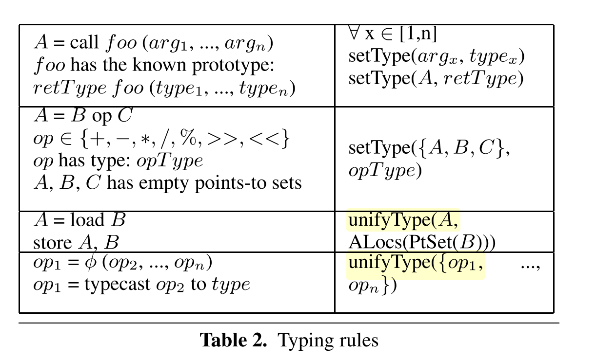
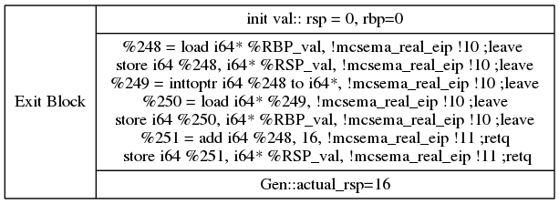
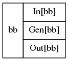

### Oct 29 2016
  - Single source test run
  
  |  Testsuite | Total | Original Supported/Unsupported | Current Supported/Unsupported | Seg Faults | Diff | Pass |
  |:----------:|:-----:|----------------------|--------------------|------------|------|------|
  |  UnitTests | 111   | 94 /17          |(94 + 10) /(17 - 10)               | 8          | (16 + 7)   | (70 + 3) | 
  | Regression | 65    | 49/16          | (49+3) / (16 - 3)              | 4          | 7 + 1  | 38 + 2 | 
   | Benchmark  | 138   | 47/91          | (47+20) / (91 - 20)   | 26         | (28 +15)  | 19 + 5 | 
  |  Multisource | 206  | 48/158   | 19/187          | 124             | 35         | 126  |

    -  Original Unsupported: cfg there but bc cannot be obtained due to some errors in the cfg2bc process.
 

### 27 Oct 2016
  - 
  
  |  Testsuite | Total IDA CFG created |  Supported(by mcsema cfg2bc) | Unsupported(by mcsema cfg2bc) | ^ Successfully generated non-vectorized executable |
  |:----------:|:-----:|-------------|-----------------|------------|
  |  SingleSource | 314   | 190          | 124              | 76 | 
  | Multisource | 206   | 45|  161          | ^^   |
  
  ^: These are the test cases from the label "CFGS Unsupported(by mcsema cfg2bc)" which I can convert to non-vectored executable. The rest cannot be converted because of error "sse register return with sse disabled"
  
  ^^: In this case, most of the unsupported testcases (#161 ) are getting the error "sse register return with sse disabled" or the unsupported instructions are other than vector instructions (so no point in generating non-vectored instructions). Here is the full list (https://github.com/sdasgup3/llvm-test-suite-mcsema/blob/master/SingleSource/unsupported.txt)


 

### 26 Oct 2016
  - Ed's test suite status
  ```
    Total cfg generated: 314
    CFG cannot get converted to BIN:  124
    Get converted to BIN :  190
  ```

  - Single source test run
  
  |  Testsuite | Total | Output Diff | CFG to BC Error | Seg Faults | Pass |
  |:----------:|:-----:|-------------|-----------------|------------|------|
  |  UnitTests | 111   | 14          | 17              | 8          | 72   |
  | Regression | 65    | 7          | 16              | 3          | 39   |
  | Benchmark  | 138   | 8          | 91              | 24         | 15   |
  |            | 314   | 29          | 124             | 35         | 126  |

  - The diff errors are due to fp instructions and va args. 
  - The cfg recovery failure are due to unsupported instructions [list of unsupported inst ](https://github.com/sdasgup3/llvm-test-suite-mcsema/blob/master/SingleSource/unsupported.txt)
  - For Multisource, the [driver](https://github.com/sdasgup3/binary-decompilation/blob/master/test/utils/driver_64.c) need to handle the input passed through registers. For Single source the inputs are
  embedded in the source file only.


### 24 Oct 2016
  - After looking into the reasons why AA is not able to disambiguate some of the memory references, we tried applying the following series of passes
      ```-mme2reg -dce -early-cse-memssa```. 
  
      Lets first go through the reasons for applying these:

    - Use of -early-cse-memssa  
      ```
      %arr = alloca i8, i8 16
      %ptr = alloca i8*

      store i8* %arr, i8** %ptr

      %loadptr1  = load i8*, i8** %ptr 
      %gep_4_loadptr1  = getelementptr inbounds i8, i8* %loadptr1, i8 4

      %loadptr2  = load i8*, i8** %ptr 
      %gep_8_loadptr2  = getelementptr inbounds i8, i8* %loadptr2, i8 8
      ```
    
      Ander's AA (-cfl-anders-aa) gives MAY_ALIAS(%gep_4_loadptr1, %gep_8_loadptr2) == true
    But if we can do commom sub-expression elimination, the later part of the code becomes

    ```
    %loadptr1  = load i8*, i8** %ptr 
    %gep_4_loadptr1  = getelementptr inbounds i8, i8* %loadptr1, i8 4
    %gep_8_loadptr2  = getelementptr inbounds i8, i8* %loadptr1, i8 8
    ```
    and AA can disambiguate %gep_4_loadptr1 and %gep_8_loadptr2  as NO_ALIAS
    
    ** NOTE: CSE may not be possible always, and that is when we have to live with spurious may alias results. **

    - Use of -mme2reg -dce
    ```
    %RAX = getelementptr inbounds %struct.regs, %struct.regs* %0, i64 0, i32 0
    %1 = load i64, i64* %RAX
    store i64 %1, i64* %RAX_val
    ...
    store i64 %Y, i64* %RAX_val
    ...
    %87 = load i64, i64* %RAX_val
    store i64 %87, i64* %RAX
    ```

    After mem2reg:
    ```
    %RAX = getelementptr inbounds %struct.regs, %struct.regs* %0, i64 0, i32 0
    %1 = load i64, i64* %RAX
    ...
    ...
    store i64 %Y, i64* %RAX
    ```

    After dce:
    ```
    %RAX = getelementptr inbounds %struct.regs, %struct.regs* %0, i64 0, i32 0
    ...
    ...
    store i64 %Y, i64* %RAX
    ```

    I tried the sequences of passes on [test_1.c](https://github.com/sdasgup3/binary-decompilation/blob/master/test/variable_recovery/test_1/test_1.c) 
    Transforming mcsema output [test_1.clang.ll](https://github.com/sdasgup3/binary-decompilation/blob/master/test/variable_recovery/test_1/Output/test_1.clang.ll) --> [test_1.clang.trans.trio.ll](https://github.com/sdasgup3/binary-decompilation/blob/master/test/variable_recovery/test_1/Output/test_1.clang.trans.trio.ll)
    
    In the transformed output, AA can disambiguate `%_new_gep_ , %_new_gep_1,  %_new_gep_4` because of the reason of cse mentioned earlier.

    Similarly, applying the same on [test_0.c](https://github.com/sdasgup3/binary-decompilation/blob/master/test/variable_recovery/test_0/test_0.c) and able to disambiguate the pointer and the structure variable.
    Transformation is from mcsema generated IR [test_0.clang.ll](https://github.com/sdasgup3/binary-decompilation/blob/master/test/variable_recovery/test_0/Output/test_0.clang.ll) to [test_0.clang.trans.trio.ll](https://github.com/sdasgup3/binary-decompilation/blob/master/test/variable_recovery/test_0/Output/test_0.clang.trans.trio.ll)

    In the transformed output, AA can disambiguate `%_new_gep_ , %_new_gep_1,  %_new_gep_3, %_new_gep_6` 


### 19 Oct 2016
  - Memory dependence analysis in general
  ```
  define  i32 @foo() {
    %x = alloca i32, align 4
    %xp = alloca i32*, align 8

    store i32 0, i32* %x
    store i32* %x, i32** %xp, align 8

    %1 = load i32*, i32** %xp, align 8
    %2 = load i32, i32* %1, align 4
    ret i32 0
  }

      Def from:   %x = alloca i32, align 4
  store i32 0, i32* %x

    Def from:   %xp = alloca i32*, align 8
  store i32* %x, i32** %xp, align 8

    Def from:   store i32* %x, i32** %xp, align 8
  %1 = load i32*, i32** %xp, align 8

    Clobber from:   store i32 0, i32* %x
  %2 = load i32, i32* %1, align 4

  ```

  ```
  define  i32 @foo() {
    %1 = alloca i32, align 4
    %result = alloca i32, align 4
    %x = alloca i32, align 4
    %xp = alloca i32*, align 8

    store i32 0, i32* %1
    store i32 5, i32* %result, align 4
    store i32 7, i32* %x, align 4
    store i32* %x, i32** %xp, align 8

    %2 = load i32, i32* %x, align 4
    %3 = icmp eq i32 %2, 4
    br i1 %3, label %4, label %7

    ; <label>:4                                       ; preds = %0 
    %5 = load i32*, i32** %xp, align 8
    %6 = load i32, i32* %5, align 4
    store i32 %6, i32* %result, align 4
    br label %8

    ; <label>:7                                       ; preds = %0
    store i32 42, i32* %result, align 4
    br label %8

    ; <label>:8
    ret i32 0
  }

  ; opt      -memdep -print-memdeps -gvn -analyze test_3.ll
  ;Def from:   %1 = alloca i32, align 4
  ; store i32 0, i32* %1

  ;Def from:   %result = alloca i32, align 4
  ;  store i32 5, i32* %result, align 4

  ;Def from:   %x = alloca i32, align 4
  ;  store i32 7, i32* %x, align 4

  ;Def from:   %xp = alloca i32*, align 8
  ;  store i32* %x, i32** %xp, align 8

  ;Def from:   store i32 7, i32* %x, align 4
  ; %2 = load i32, i32* %x, align 4

  ;Def in block %0 from:   store i32* %x, i32** %xp, align 8
  ; %5 = load i32*, i32** %xp, align 8

  ;Unknown in block %4
  ; %6 = load i32, i32* %5, align 4

  ; Def in block %0 from:   store i32 5, i32* %result, align 4
  ; store i32 %6, i32* %result, align 4

  ; Def in block %0 from:   store i32 5, i32* %result, align 4
  ; store i32 42, i32* %result, align 4

  ; opt -basicaa    -aa-eval -print-all-alias-modref-info test_2.ll  -disable-output
  ;NoAlias:	i32* %1, i32* %result
  ;NoAlias:	i32* %1, i32* %x
  ;NoAlias:	i32* %result, i32* %x
  ;NoAlias:	i32* %1, i32** %xp
  ;NoAlias:	i32* %result, i32** %xp
  ;NoAlias:	i32* %x, i32** %xp
  ;NoAlias:	i32* %1, i32* %5
  ;NoAlias:	i32* %5, i32* %result
  ;MayAlias:	i32* %5, i32* %x
  ;NoAlias:	i32* %5, i32** %xp
  ```
 - Memory dependence analysis on mcsema generated IR
 (test)[https://github.com/sdasgup3/binary-decompilation/blob/master/test/variable_recovery/test_1/Output/test_1.clang.trans.ll]


### 12 Oct 2016
- All the testsuite testcases are converted to allexe and tested

  ```
Format::binary --> tool::Mcsema --> Format::LLVM IR --> Tool::ALLIN --> Format::IR --> Tool::bc2allvm --> Format::allexe
                                            |                          |                             | 
                                            |                          |                             |
                                            |                          |_\ Tool::clang -> O2         |_\ Tool::alley --> O3
                                            |                            /                             /
                                            |__\ Tool::clang --> O1         Passing Definition: O 1 == O 2 == O 3
                                               / 
  ```

- Problem with indirect calls [calgrapph](Figs/test_23_1.callgraph.pdf)
  - Till now first we identify the calls and agment them with actual arguments (parent %rsp and parent %rbp pointer) and go to the called function to augment the formal arguments.
  - This is not possible for idirect calls
  - Proposed Soln: Modify all the internal functions and call to non library function 

- Experiment with `opt  -cfl-anders-aa -aa-eval   -print-all-alias-modref-info`
```
define void @main() {
entry:
  %X =  alloca i8*
  %Y =  alloca i8*

  %a =  alloca i8, i64 32
  %b =  alloca i8
  %c =  alloca i8

  store i8* %a, i8** %X
  store i8* %b, i8** %Y

  %LX = load i8* , i8** %X
  %LY = load i8* , i8** %Y
}
Anders Query
  NoAlias:	i8* %LX, i8* %LY

```

```
define void @main() {
entry:
  %X =  alloca i8*
  %Y =  alloca i8*

  %a =  alloca i8, i64 32
  %b =  alloca i8
  %c =  alloca i8

  store i8* %a, i8** %X
  store i8* %b, i8** %Y

  %LX = load i8* , i8** %X
  %LY = load i8* , i8** %Y

  %_new_addr_ = getelementptr i8, i8* %LX, i64 8
  %_new_val_  = ptrtoint i8* %LY to i8
  store i8 %_new_val_ , i8* %_new_addr_
  store i8* %_new_addr_ , i8** %X
  ; The folllowing makes %LX %LY May Alias
   store i8* %_new_addr_ , i8** %Y
}

```
[anders AA](Figs/anders_AA.jpg)


### 06 Oct 2016

#### Variable Recovery 
##### Stage I: Transforming the mcsema generated IR so as to facilitate alias analysis 
  - Because of the presenseof int2ptr in mcsema generated code, AA like basic AA is not 
  giving any meaningful results. So we decide to avoid the int2ptr/ptrtoints as much as possible.

  ```llvm
  ; Consider the code before the transformation, test.ll
  define internal void @foo() {
  entry:
    %RSP_val = alloca i64

    %_local_stack_start_ptr_ = alloca i8, i64 32
    %_local_stack_end_ptr_ = getelementptr inbounds i8, i8* %_local_stack_start_ptr_, i64 32
    %_local_stack_end_ = ptrtoint i8* %_local_stack_end_ptr_  to i64

    store i64 %_local_stack_end_, i64* %RSP_val

    %0 = load i64, i64* %RSP_val
    %1 = inttoptr i64 %0 to i64*
    store i64 0, i64* %1

    %2 = add i64 %0, -16
    %3 = inttoptr i64 %2 to i64*
    store i64 1, i64* %3
    ret void
  }
  $ opt -basicaa -aa-eval -print-alias-sets   test.ll -disable-output 
  Alias sets for function 'foo':
  Alias Set Tracker: 1 alias sets for 3 pointer values.
  AliasSet[0x27a2c90, 3] may alias, Mod/Ref   Pointers: (i64* %RSP_val, 8), (i64* %1, 8), (i64* %3, 8)

  $ opt -basicaa -aa-eval -print-all-alias-modref-info    test.ll -disable-output 
  Function: foo: 5 pointers, 0 call sites
  NoAlias:	i64* %RSP_val, i8* %_local_stack_start_ptr_
  NoAlias:	i64* %RSP_val, i8* %_local_stack_end_ptr_
  NoAlias:	i8* %_local_stack_end_ptr_, i8* %_local_stack_start_ptr_

  MayAlias:	i64* %1, i64* %RSP_val
  MayAlias:	i64* %1, i8* %_local_stack_start_ptr_
  MayAlias:	i64* %1, i8* %_local_stack_end_ptr_
  MayAlias:	i64* %3, i64* %RSP_val
  MayAlias:	i64* %3, i8* %_local_stack_start_ptr_
  MayAlias:	i64* %3, i8* %_local_stack_end_ptr_
  MayAlias:	i64* %1, i64* %3

  ; Consider the code after the transformation, test.trans.ll
  define internal void @foo() {
  entry:
    %_RSP_ptr_ = alloca i8*

    %_local_stack_start_ptr_ = alloca i8, i64 32
    %_local_stack_end_ptr_ = getelementptr inbounds i8, i8* %_local_stack_start_ptr_, i64 32


    store i8* %_local_stack_end_ptr_, i8** %_RSP_ptr_

    %_load_rsp_ptr_ = load i8*, i8** %_RSP_ptr_
    %_allin_new_bt_ = bitcast i8* %_load_rsp_ptr_ to i64*
    store i64 0, i64* %_allin_new_bt_

    %_new_gep_ = getelementptr i8, i8* %_load_rsp_ptr_, i64 -16
    %_allin_new_bt_2 = bitcast i8* %_new_gep_ to i64*
    store i64 1, i64* %_allin_new_bt_2
    ret void
  }


  $ opt -basicaa -aa-eval -print-alias-sets   test.trans.ll -disable-output 
  Alias sets for function 'foo':
  Alias Set Tracker: 3 alias sets for 3 pointer values.
  AliasSet[0x3760c40, 1] must alias, Mod/Ref   Pointers: (i8** %_RSP_ptr_, 8)
  AliasSet[0x3760ce0, 1] must alias, Mod       Pointers: (i64* %_allin_new_bt_, 8)
  AliasSet[0x3760d80, 1] must alias, Mod       Pointers: (i64* %_allin_new_bt_2, 8)

  $ opt -basicaa -aa-eval -print-all-alias-modref-info    test_2.trans.ll -disable-output 
  Function: foo: 7 pointers, 0 call sites
  MustAlias:	i64* %_allin_new_bt_, i8* %_load_rsp_ptr_
  MustAlias:	i64* %_allin_new_bt_2, i8* %_new_gep_

  NoAlias:	i8* %_local_stack_start_ptr_, i8** %_RSP_ptr_
  NoAlias:	i8* %_local_stack_end_ptr_, i8** %_RSP_ptr_
  NoAlias:	i8* %_local_stack_end_ptr_, i8* %_local_stack_start_ptr_
  NoAlias:	i8* %_load_rsp_ptr_, i8** %_RSP_ptr_
  NoAlias:	i64* %_allin_new_bt_, i8** %_RSP_ptr_
  NoAlias:	i8* %_new_gep_, i8** %_RSP_ptr_
  NoAlias:	i8* %_load_rsp_ptr_, i8* %_new_gep_
  NoAlias:	i64* %_allin_new_bt_, i8* %_new_gep_
  NoAlias:	i64* %_allin_new_bt_2, i8** %_RSP_ptr_
  NoAlias:	i64* %_allin_new_bt_2, i8* %_load_rsp_ptr_
  NoAlias:	i64* %_allin_new_bt_, i64* %_allin_new_bt_2

  MayAlias:	i8* %_load_rsp_ptr_, i8* %_local_stack_start_ptr_
  MayAlias:	i8* %_load_rsp_ptr_, i8* %_local_stack_end_ptr_
  MayAlias:	i64* %_allin_new_bt_, i8* %_local_stack_start_ptr_
  MayAlias:	i64* %_allin_new_bt_, i8* %_local_stack_end_ptr_
  MayAlias:	i8* %_local_stack_start_ptr_, i8* %_new_gep_
  MayAlias:	i8* %_local_stack_end_ptr_, i8* %_new_gep_
  MayAlias:	i64* %_allin_new_bt_2, i8* %_local_stack_start_ptr_
  MayAlias:	i64* %_allin_new_bt_2, i8* %_local_stack_end_ptr_
  ```

  - With this transformation all the [tests](https://github.com/sdasgup3/binary-decompilation/tree/master/test) are passing. 
  ```
    Fromat::binary --> tool::Mcsema --> Format::LLVM IR --> Tool::ALLIN --> Format::IR
                                            |                                   | 
                                            |                                   |
                                            |                                   |____\ Tool::clang --> Output2
                                            |                                        /
                                            |__\ Tool::clang --> Output1         Passing Definition: Output 1 == Output 2
                                               / 
  ```
  - Implementation Details
    - [test] (https://github.com/sdasgup3/binary-decompilation/blob/var_recovery/test/variable_recovery/test_0/test_0.c) 
      [diff](https://github.com/sdasgup3/binary-decompilation/commit/6bdf336bedab73d3fa6b2a7aeb385a2ecd6a3a88) 

    - [test] (https://github.com/sdasgup3/binary-decompilation/blob/var_recovery/test/variable_recovery/test_1/test_1.c)
      [diff](https://github.com/sdasgup3/binary-decompilation/commit/ca0411e10489e11345d12e4bbd5b6ee29affa8c0)
    - 
    - The transformation happens in 2 phases. First new instructions are added based on fact that loads/stores of i64\* RSP\_val (or RBP_val) 
      need to be replaced with corresponding loads/stores of i8** RSP_ptr (or RBP_ptr). But the old insructions are still kept. In the second phase 
      dce removes most if the dead instructions.

      ```llvm
        ; %rax = MEM[rbp + 40]
        %84 = load i64, i64* %RBP_val
        %85 = add i64 %84, 40
        %86 = inttoptr i64 %85 to i64*
        %87 = load i64, i64* %86
        store i64 %87, i64* %RAX_val

        ; Phase 1
        %_new_load_4 = load i8*, i8** %_RBP_ptr_
        %87 = load i64, i64* %RBP_val

        %_new_gep_5 = getelementptr i8, i8* %_new_load_4, i64 40
        %88 = add i64 %87, 40

        %_new_bt_6 = bitcast i8* %_new_gep_5 to i64*
        %89 = inttoptr i64 %88 to i64*

        %90 = load i64, i64* %_new_bt_6
        store i64 %90, i64* %RAX_val

        ; Phase 2; After dce
        %_new_load_4 = load i8*, i8** %_RBP_ptr_
        %_new_gep_5 = getelementptr i8, i8* %_new_load_4, i64 40
        %_new_bt_6 = bitcast i8* %_new_gep_5 to i64*
        %90 = load i64, i64* %_new_bt_6
      ```
  - Whats is going to be the pointer type of RSP_ptr or RBP_ptr 
  ```
    /* if we use RSP_ptr as i64** */
    RSP_ptr = i64* alloca
    ...

    // Usage 1
  %1  = load i64** RSP_ptr
  %2  = bitcast i64* %1 to i8*
  %3  = getelementptr i8, i8* %2, i32 offset
  %4 = bitcast i8* %3 to i32* 
  store i32 val, i32* %4

  // Usage 2
  %1  = load i64** RSP_ptr
  %2  = bitcast i64* %1 to i8*
  %3  = getelementptr i8, i8* %2, i32 offset
  %4 = bitcast i8* %3 to i64*
  store i64* %4, i64** %RSP_ptr

  /* if we use RSP_ptr as i8** */
  RSP\_ptr = i8*
  ...

  // Usage 1
  %1  = load i8** RSP_ptr
  // NOT REQUIRED %2  = bitcast i64* %1 to i8*
  %3  = getelementptr i8, i8* %2, i32 offset
  %4 = bitcast i8* %3 to i32* 
  store i32 val, i32* %4

  // Usage 2
  %1  = load i8** RSP_ptr
  // NOT REQUIRED %2  = bitcast i64* %1 to i8*
  %3  = getelementptr i8, i8* %2, i32 offset
  // NOT REQUIRED %4 = bitcast i8* %3 to i64*
  store i64* %4, i8** %RSP_ptr

  ```


### 21 Sept 2016

## Function prototype detection
Currently the register context contain all all the registers except the
stack which we managed to chop off from it.
The idea here is to get pass and return  only those registers 
which are relevant.

Consider the folowing snippet of MCSema extracted IR
This is to show that some registers like  %CTX.XMM15 are not "really"
used in the function as opposed to %CTX.RSP

```llvm
define internal x86_64_sysvcc void @foo(%struct.regs* %CTX) {
entry:
  ; Allocating the local stack of size  32*64 bits, 32 is inferred from static stack height computation  

  %_local_stack_alloc_ = alloca i64, i64 32
  %_local_stack_start_ptr_ = getelementptr inbounds i64* %_local_stack_alloc_, i32 0
  %_local_stack_start_ = ptrtoint i64* %_local_stack_start_ptr_ to i64
  %_local_stack_end_ = add i64 %_local_stack_start_, 32

  ; Local allocas for register variables
  %XMM15_val = alloca i128
  %RSP_val = alloca i64 

  ; Storing values to to local allocas
  %XMM15 = getelementptr inbounds %struct.regs* %0, i64 0, i32 69
  %74 = load i128* %XMM15
  store i128 %74, i128* %XMM15_val

  store i64 %_local_stack_end_, i64* %RSP_val

  ; "Real" Use of RBP_val 
  ; Code for mov %rbp to %rsp
  %77 = load i64* %RBP_val, !mcsema_real_eip !2
  %78 = load i64* %RSP_val, !mcsema_real_eip !2
  %79 = add i64 %78, -8
  %80 = inttoptr i64 %79 to i64*, !mcsema_real_eip !2
  store i64 %77, i64* %80, !mcsema_real_eip !2

  ; Using just to store it back to register context
  %168 = load i128* %XMM15_val, !mcsema_real_eip !8
  store i128 %168, i128* %XMM15, align 1, !mcsema_real_eip !8

  call bar();

  %238 = load i128* %XMM15, align 1, !mcsema_real_eip !8
  store i128 %238, i128* %XMM15_val, !mcsema_real_eip !8

  ...

  %338 = load i128* %XMM15_val, !mcsema_real_eip !13
  store i128 %338, i128* %XMM15, align 1, !mcsema_real_eip !13
```

The take away is
  - Cuurently all the registers are passed on as arguments to all the functions
  - All the registers are returned from all the function using the struct context register  pointer.
  - The aim for "Function prototype detection" to is to figure out 
    - The arguments to functions, which will then be passed as arguments
    - The return values; which will be returned from the function and in case of multiple values, returned as
    a struct.

Consider the example which demonstrats that a register potentially written in a caller should be passed as argument
of all the subsequent callee.

```
foo () {                   bar () {          car() {
  reg_defined                  car();        reg_used;
    bar();                        
}                           }                 }

```

Consider the example which demonstrats that a register potentially written in a callee will be returned  to all the 
ancestor callers

```
foo () {                   bar () {          car() {
    bar();                        
    reg_used                  car();        reg_sritten;
}                           }                 }

```

## Using a poiner analysis for tracking variables
The idea here is to use pointer analysis to 
partition the local stack which will give us 
start points of variables and using range analysis
to figure out the sizes of those partitions.

```
; Allocating the local stack of size  32*64 bits, 32 is inferred from static stack height computation  
  %_local_stack_alloc_ = alloca i64, i64 32
  %_local_stack_start_ptr_ = getelementptr inbounds i64* %_local_stack_alloc_, i32 0
  %_local_stack_start_ = ptrtoint i64* %_local_stack_start_ptr_ to i64
  %_local_stack_end_ = add i64 %_local_stack_start_, 32

  store i64 %_local_stack_end_, i64* %RSP_val

  ; "Real" Use of RBP_val 
  ; Code for mov %rbp to %rsp
  %78 = load i64* %RSP_val, !mcsema_real_eip !2
  %79 = add i64 %78, -8
  %80 = inttoptr i64 %79 to i64*, !mcsema_real_eip !2
  store i32 10, i64* %80, !mcsema_real_eip !2

  %81 = add i64 %78, -12
  %82 = inttoptr i64 %79 to i64*, !mcsema_real_eip !2
  store i32 20, i64* %80, !mcsema_real_eip !2
```

So here we are looking for a AA which  should say that
%80 and %82 are not aliased.
Tried with basicAA, globalsmodref-aa and scev-aa and all of them 
says that the locations are aliased. Need to try ander-aa and dsa-aa


## Rules for type inferences
We can model a simple type analysis as follows:
1. Multiplication, substraction, shifting, xor, binary and, binary or and division force their “parameters”
to be integers.
2. Dereferencing forces its parameter to be a pointer.
3. The return values of standard library functions are maintained.
4. Any variable that is branched on is a boolean.
5. If two variables are added together and one is a pointer, the other is an integer.
6. If two variables are added together and one is an integer, the other is either a pointer or an integer.
7. If two variables are compared with <, >, >= or <=, they are both integers.
8. If two variables are compared with == or !=, they have the same type.
9. If something is returned from main(), it is an integer.
10. If the value of one variable is moved into another variable, they have the same type.
11. If the dereferenced value of a pointer has type τ , then the pointer has type τ∗.
12. The sum of a pointer of type τ ∗ and an integer is a pointer, but not necessarily of type τ

### 31 Aug 2016
- Finished the okmplementation of stack decpnstruction 
  ```
    Before the transformation the mcsema code looks like this
    define fiunc(struct %0) {
      //For accessing register in the struct
      RAX_val = alloca
      RAX = getelementptr .. // read the register loc in the struct
      %temp  = load  RAX
      store %temp RAX_val 

      //For accessing the stack in the struct 
      RSP_val = alloca
      RSP = getelementptr .. // read the stack loc in the struct
      %temp  = load  RSP
      store %temp RSP_val // assign the start addres of the stack to local variable RSP_val

      ....

      ... = load RAX_val
      ... = load RSP_val    // or any offset from RSP_val
    }

      After the moficication 

    define func(struct %0, %parent_stack_end ) {
        %_local_stack_alloc_ = alloca i64, i64 0
        %_local_stack_start_ptr_ = getelementptr inbounds i64* %_local_stack_alloc_, i32 0
        %_local_stack_start_ = ptrtoint i64* %_local_stack_start_ptr_ to i64
        %_local_stack_end_ = sub i64 %_local_stack_start_, 0 //To be passed to any called function

      //For accessing register in the struct
      RAX_val = alloca
      RAX = getelementptr .. // read the register loc in the struct
      %temp  = load  RAX
      store %temp RAX_val 

      //For accessing the stack in the struct 
      RSP_val = alloca
      RSP = getelementptr .. // read the stack loc in the struct
      %temp  = load  RSP

      store %_local_stack_start_ RSP_val // assign the start addres of the stack to local variable RSP_val

      ....

      if(RAX_val < _local_stack_start_) {  // As the alloca of local stack _local_stack_alloc_ is before the alloca of RAX_val, this condition should always be true
      ... = load RAX_val
      } else {
        //compute the offset in the parent stack and load it
      }

      if(RSP_val < _local_stack_start_) {     
        ... = load RSP_val
      }else {
        %offset = RSP_val - _local_stack_start_;
        %address_in_parent_stack =  %offset + %parent_stack_end;
        ... = load %address_in_parent_stack
      }
  ```


### 23 Aug 2016
- Worked on deconstruction the global stack ( which is shared by all the procedures ) into per procedure stack frame
  - Transforming all the dereferences into the following checks
  ```C
  Let 
  curr_frame_start_ptr: Base address of the current stack frame
  parent_frame_start_ptr: Base address of the parent frame


  if(PTR < curr_frame_start_ptr) { 
    //PTR corresponds to current procedure stack frame
    //dereference as usual
  } else {
    offset_in_parent_stack1 = PTR - curr_frame_start_ptr;
    offset_in_parent_stack = offset_in_parent_stack1 - 8; // This 8 bits is to get past the location used for return address storage
    dereference *[ (parent_frame_start_ptr + parent_frame_height) - offset_in_parent_stack)]
  }
  ```

  Note: Currently all the load/store instructions are transformed like above.
  But if we have a static analysis like VSA, then for many cases we will be
  able to know the precise value of PTR and can prevent emitting these static checks. But
  we still be emiting the checks for those PTR's for which VSA fails to infer
  the values(e.g the values load from memory).

  - Getting rid of impreciseness in computing stack heights statically
  
    Before doing this stack deconstruction, we were statically computing the stack heights and using that to compute the 
    ```parent_frame_start_ptr + parent_frame_height```. 
    As we can imagine that computing the precise value the above needs
    precise value of the stack height, which is not possible with a static analysis.

    Currently we still be using the statically computed stack heights which is actually the maximum possible  height that the stack can grow.
    And based on that will allocate a stack S. 
    We will be instrumenting all the stack writes (writes within the boundaries of S) so as to track the last written location. 

    [mail link] (https://github.com/sdasgup3/binary-decompilation/blob/stable/docs/Retped.md)

### 27 Jul 2016

- Starting referring the dissertation: POLYMORPHIC TYPE INFERENCE FOR LANGUAGES WITH OVERLOADING AND SUBTYPING, Geoffrey Seward Smith

- Few relevant questions w.r.t the polymorphic type inference paper.
  - Question 1
    In reference to this particular paper, is variable recovery included in this type inference ? Or the variables (like scalar and aggregate variables) are already recovered before this particular type inference kicks in ? Or variable recovery is irrelevant  in the context of this paper,  because this paper only talks about inferring the type of stack offsets?
  
    From the constraints generated (as given in Figure 2), it seems that some constraints considers the offset information of the  fields of  a structure (w.r.t the procedure's base pointer ), which after solving is going to help in knowing the type of the those fields. But it is not obvious to me if this particular paper is doing any kind of "structure variable" recovery using those offset information ? 

    More specifically, In figure 2 of the paper, we can see the following constraints corresponding to instructions mov eax ,dword [edx]  and mov eax ,dword [edx + 4] respectively.
    ```
    >  τ.load.σ32@0 <: τ 
    > τ.load.σ32@4 <: int ∧#FileDescriptor
    ```
  
    Are these constraints  also used to infer a "structure variable" with two fields at offset 0 and 4? Or its is used just to infer the type of the variables at offsets 0 and 4 from the base pointer of the procedure?

  - Question2

    This question is  related to my previous question.

    As you  mentioned  that you do not need any pointer analysis information to infer that x has a the type struct S { struct S *, ...}*. I believe that the way you achieve this is by adding a new  constraint for each instruction corresponding to the access of the fields of x and solving them later. (Please correct me if I am wrong here).  If this is correct, then doesn't that mean that you  already have the information that x is a struct (but of course without the type information of its fields) before starting this type inference?

#### 07th June 2016
1. Review of "Polymorphic type inference for machine code"
  
  ```
  The mean distance to the true type was 0.54 for Retypd, compared to 1.15 for dynamic TIE, 1.53 for REWARDS, 
  1.58 for static TIE, and 1.70 for SecondWrite. The mean interval size shrunk to 1.2 with Re- typd, compared to 1.7 for SecondWrite and 2.0 for TIE.
  ```
  
  ```
  ElWazeer et al. [8] also in- troduced a multi-level pointer accuracy rate, which attempts to quantify how many “levels” of pointers were correctly in- ferred. On SecondWrite’s benchmark suite Retypd attained a mean multi-level pointer accuracy of 91%, compared with SecondWrite’s reported 73%. Across all benchmarks, Re- typd averages 88% pointer accuracy.
  ```
  
  ```
  SecondWrite’s overall conservativeness is 96%, measured on a subset of the SPEC2006 benchmarks; Retypd attained a slightly lower 94% on this subset.
  ```
2. Retyped uses subtyping based type inference as opposed to unificatiion based in Second write. And it seems that that is what gives all the better performance numbers 
3. This paper does  not seem to do any kind of variable recovery. They quote in page 5, second column , last but one para:
  
  ```
  These rules ensure that Retypd can perform “iterative
variable recovery”; lack of iterative variable recovery was cited by the authors of the Phoenix decompiler [27] as a common cause of incorrect decompilation when using TIE [15] for type recovery.
  ```
4. From Second write paper:
  
```
Integrating our variable identification system with type recovery makes the type 
recovery simpler because it will need only recover scalar types like integers, floats and doubles. 
Structures and arrays are detected as part of the variable identification. 
```
 from [paper](papers/second_write_pldi_13.pdf) 

```
For the other operations in the table, we propagate the types using the function unifyType. 
This function attempts to set the data type of all the given symbols andALocs to be the same.
At least one of the symbols or the ALocs given to that function should be typed. Whenever this 
function finds conflicting types, it gives up and does not update any types. It is used for copy 
operations like type casts and phi nodes. It is also used to propagate types through memory as shown 
in the rules for stores and loads. Interprocedural information is propagated by unifying the formal and 
actual arguments types at a call instruction. The return value data type at the call site is unified 
with all the data types of all return values appearing in the return statements inside the called function body.
```


#### 16th May 2016
1. Handling  "Arguments passed to callee using parent stack frame"
  - The call instrutions (to mcsema generated functions) are modified to add caller stack frame as an extra argument. **DONE** [commit](https://github.com/sdasgup3/binary-decompilation/commit/9e88a03c60b2fcd856e732f993d5e4c1ab09d165)
  - Planning to add checks after add instrutions to rsp and rbp such that if the access if beyond the current stack frame (in the positive) 
    direction, then access the parent stack frame to access the argument. **WIP**

#### 10th May 2016
1. Implemented and tested a basic [pass](https://gitlab-beta.engr.illinois.edu/llvm/binary-decompilation/commit/d93134557d37e3f48b8100768f82392c797ad7ca) which maps the access w.r.t to the global stack
(provided by mcsema register context) to local stack per procedure.
  - This is a transform pass on the mcsema generated llvm ir. 
  - This is done by replacing the following instructions in each procedure
  
  ``` llvm
    %RSP_val = alloca i64, !mcsema_real_eip !2 

    %RSP = getelementptr inbounds %struct.regs* %0, i64 0, i32 6, !mcsema_real_eip !2 ; Reading the register context to get the stack pointer
    %7 = load i64* %RSP, !mcsema_real_eip !2

    store i64 %7, i64* %RSP_val, !mcsema_real_eip !2  ; Storing the stack pointer in the local variable %RSP_val
    ; All subsequesnt computations are using %RSP_val
  ```

  by

  ``` llvm
    %RSP_val = alloca i64, !mcsema_real_eip !2

    ; Following two are dead instructions
    %RSP = getelementptr inbounds %struct.regs* %0, i64 0, i32 6, !mcsema_real_eip !2 ; 
    %7 = load i64* %RSP, !mcsema_real_eip !2

    %_local_stack_alloc_ = alloca [32 x i64]   ; The stack height 32 is determined by a previous dfa pass    ; Newly inserted
    %_local_stack_gep_ = getelementptr inbounds [32 x i64]* %_local_stack_alloc_, i32 0, i32 0  ; Newly inserted
    %_local_stack_P2I_ = ptrtoint i64* %_local_stack_gep_ to i64                                ; Newly inserted
    store i64 %_local_stack_P2I_, i64* %RSP_val                                                 ; Newly inserted
    ; All subsequesnt computations are using %RSP_val
  ```
2. Limitation: Arguments passed to callee using parent stack frame are not handled yet. 
  - Planning to pass the parent proc's local stack as an argument to callee so that callee can access them.


#### 2nd May 2016
---------------------
1. Fixed a issue with the previous implementation 
    - There is a difference in which gcc and clang generated there prologue and epilogue for each function.
        - clang generated binary	  
        
        ```llvm
        //prologue
        push   %rbp
        mov    %rsp,%rbp
        sub    $0x20,%rsp	    // Allocation for local space
        ...
        //epilogue
        add    $0x20,%rsp	    // De-Allocation of local space
                                // At this point the rsp is pointing to the stack loc containing 
                                // previously pushed  rbp
        pop    %rbp		
        retq                    // pop the return address
        ```

        and corresponding mcsema generated llvm ir for last 2 instructions

        ```llvm
        %254 = load i64* %RSP_val
        %268 = inttoptr i64 %254 to i64*, !mcsema_real_eip !12  ;popq	%rbp
        %269 = load i64* %268, !mcsema_real_eip !12             ;popq	%rbp
        store i64 %269, i64* %RBP_val, !mcsema_real_eip !12     ;popq	%rbp
        %270 = add i64 %254, 16, !mcsema_real_eip !13           ;retq
        store i64 %270, i64* %RSP_val, !mcsema_real_eip !11     ;retq
        ```
        
        - gcc generated binary	  

        ```llvm
        //prologue
        push   %rbp
        mov    %rsp,%rbp
        sub    $0x20,%rsp	// Allocation for local space
        ...
        //epilogue
        leaveq                // %rsp = %rbp; pop %rbp 
        retq                  // pop the return address
        ```
        and corresponding mcsema generated llvm ir for last 2 instructions

        ```llvm
        %248 = load i64* %RBP_val, !mcsema_real_eip !10           ;leave
        store i64 %248, i64* %RSP_val, !mcsema_real_eip !10       ;leave
        %249 = inttoptr i64 %248 to i64*, !mcsema_real_eip !10    ;leave
        %250 = load i64* %249, !mcsema_real_eip !10               ;leave
        store i64 %250, i64* %RBP_val, !mcsema_real_eip !10       ;leave
        %251 = add i64 %248, 16, !mcsema_real_eip !11             ;retq
        store i64 %251, i64* %RSP_val, !mcsema_real_eip !11       ;retq
        ```
    - The issue (explained next) is with the gcc generated binary and related to leave instrcution. 
    - In the previous implementation, before doing the global iterative dfa, we determine the local (i.e. restricted to a bb) constant (i.e. does not depend on In/Out) Gen <actual_rsp, max_disp_rsp, actual_rbp, max_disp_rbp> as follows:

        ```
        Gen[bb]::actual_rsp = Actual displacement of rsp across the bb with initial value of rsp/rbp assumed as 0.

        Gen[bb]::max_disp_rsp = max (Out[I]::max_disp_rsp) for all I in bb.
        - correspondingly for rbp -
        ```  
        
        **Note Gen is calculated with initial value of rsp/rbp as 0.**
    - Consider the calculation of actual_rsp component of Gen for an exit block (which will have the epilouge) for gcc generated binary
        -   
    - The actual rsp calculation (which is supposed to be rsp = rbp; rsp += 16;) 
        is wrong as we have not considered the fact that actual_rsp is dependent on the In::actual\_rbp. 
        In other words, the calculation of Gen is not a local property, but
        dependent on the In.
    - So we modified the global dfa so that gen are calculated during the iterative global dfa.

#### 21 April 2016
---------------------
1. Testing the previous implementation with icc (clang and gcc are working fine) generated binary
  - icc generated binary gives error with external calls
2. Started on the implementation on converting accesses on global mcsema stack to 
  per function stack accesses.
3. Augment the automated testing with switches to generate binaries (to be consumed by mcsema) using different coppilers.
4. Planning to augment the automated testing with switches for different calling conventions


#### 14 April 2016
---------------------
1. Implemented a pass to "find the maximum stack height  growth"
  - A forward data flow analysis (dfa).
  - Each program point is associated with the following data flow value : {`actual_rsp`, `actual_rbp`, `max_disp_rsp`, `max_disp_rbp`} where
    - `actual_rsp` ( or `actual_rbp`) =  Actual displacement of `%rsp` (or `%rbp`). For example, for a statement `sub $0x20,%rsp`, if `%rsp` value is `x` before the statement, then  `actual_rsp` becomes `x - 32` after it.
    - `max_disp_rsp` ( or `max_disp_rbp)` =  Offset of the stack access w.r.t `%rsp` (or `%rbp`). For example, for a statement `mov -0x4(%rsp),%esi`, if `%rsp` value is `x` before the statement, then `max_disp_rsp` becomes `x-4` after it.
    - Note: Both `actual_rsp` and `max_disp_rsp` need to be separately tracked. 
      - Problem with having only `actual_rsp`

      ```llvm
        sub $0x8,%rsp
        mov -0xc(rsp), %edi ;actual_rsp = -8, but   max stack height = -0xc - Ox8
      ```
      - Problem with having only `max_disp_rsp` (in negative direction)

      ```llvm
        sub $0x8,%rsp
        sub $0xc,%rsp  ;max_disp_rsp = -0xc, but  max stack height = -0x14
      ``` 
      - Also just adding the offsets will not do.

      ```llvm
        mov -0x8(rsp), %edi
        sub $0xc, %rsp        ;Adding the constants gives max stack height as 0x14, but its actually -0xc. 
      ```
  - Local dfa within a bb: Calculating `Gen[bb]`
    - Each instruction `I` (which may potentially affect rsp or rbp) within a bb is tracked to obtain the data flow values before, `In[I]` and after, `Out[I]`.
      [This example](fig_1.png) captures all kinds of instructions considered and how the data values are propagated from one instruction to other within a bb. The call instruction in the figure results in to ` %rsp += 8` because it is assumed that the function is well formed with conventional prologue and epilogue and the only change that can happen to `%esp` is pop of return address.
    - After the data value propagation, Gen[bb] is computed as follows:
      
      ```
        Gen[bb]::actual_rsp = Actual displacement of rsp across the bb with initial value of rsp/rbp assumed as 0.
        Gen[bb]::max_disp_rsp = max (Out[I]::max_disp_rsp) for all I in bb.
      ```  
    - In the running example, `Gen[bb] = { 8, -64, 0, 0}`                                   

  - Global dfa: Calculating `In[bb]` and `Out[bb]` 
    - Meet operator: Calculating `In[bb]` as a function of `Out[pped_bb]`,

    ```javascript
      //For any pair of predecessor pred_bb_x and pred_bb_y
      if ( Out[pred_bb_x]::actual_rsp == OUT[pred_bb_y]::actual_rsp &&  
          OUT[pred_bb_x]::actual_rbp == OUT[pred_bb_y]::actual_rbp) {
        In[bb]::actual_rsp  = Out[pred_bb_x]::actual_rsp;
        In[bb]::actual_rbp  = Out[pred_bb_x]::actual_rbp;
        In[bb]::max_disp_rsp  = min ( OUT[pred_bb_x]::max_disp_rsp, OUT[pred_bb_y]::max_disp_rsp)
        In[bb]::max_disp_rbp  = min ( OUT[pred_bb_x]::max_disp_rbp, OUT[pred_bb_y]::max_disp_rbp)
      } else {
        In[bb] = Bottom
      }
    ```
    - The value `Bottom` (no useful information) is for the cases where the `%rsp` or `%ebp` is *updated* differently in control flow paths before the join. This is going to solve two scenarios

      - Consider two branches of a conditional statement; in both of them
      `%rsp` is updated differently and then an ancestor variable is accessed .
      Now if we choose  height = max of `%rsp` updates, and use it to deconstruct
      the global stack to local stack frame, then in case of indirect access it
      will not be possible to put a static check to distinguish which stack
      frame the access belongs to.
      - If in the while loop body `%rsp` is updated, then it is not statically possible
      to figure out the value of stack height and we get `Bottom` in that scenario
      as well.
    
    - Transfer function: Calculating `Out[bb]` as a function of `Gen[bb]` and `In[bb]`
    
      ```javascript
      if(In[bb] == Bottom) {
        Out[bb] =  Bottom;
      } else {
        Out[bb]::actual_rsp = In[bb]::actual_rsp + Gen[bb]::actual_rsp;
        Out[bb]::actual_rbp = In[bb]::actual_rbp + Gen[bb]::actual_rbp;
        Out[bb]::max_disp_rsp = min ( In[bb]::actual_rsp + Gen[bb]::max_disp_rsp, In[bb]::max_disp_rsp;
        Out[bb]::max_disp_rbp = min ( In[bb]::actual_rbp + Gen[bb]::max_disp_rbp, In[bb]::max_disp_rbp;
      }
      ```
      - A `Bottom` in `In` or `Out` prevents deconstruction of stack frames. During testing we do **NOT** get any cases with `Bottom` appering in `In` or `Out`.
      
    - [This example] (https://github.com/sdasgup3/binary-decompilation/blob/master/source/test/max-stack-height/test_5/cfg.png) shows two cfgs corresponding to main (bigger one) and draw routines of [maze
    program](https://github.com/sdasgup3/binary-decompilation/blob/master/source/test/max-stack-height/test_5/test_5.c)
    with the following interpretation ( Note: _The reported  `In[bb]`, `Gen[bb]` and `Out[bb]` are fixedpoint values_ )  

      

  - Max stack height of function F

    ```javascript
      max ( Out[bb]::max_disp_rsp, Out[bb]::max_disp_rsp ) for  all bb.  
    ```

2. Tested the implementation.
  - A [testsuite] (../source/test/max-stack-height/) is incrementally created. 
    - Added 25 test cases including all the demo testcases with which mcsema is tested.
    - In **none** of cases, the value `Bottom` is reached.
    - Each test case folder contains a png file, showing the cfg and associaed fixed point values of `In`, `Gen` and `Out`. [This example] (https://github.com/sdasgup3/binary-decompilation/blob/master/source/test/max-stack-height/test_24/cfg.png) shows one of the complex cfgs handled.


#### 7 March 2016 
-------------
* variable recovery algorithm 
  1. Deconstruct the monolithic stack that mcsema uses into local stack for each procedure.
    - Use a data flow analysis to identify the max stack height of each procedure. Its OK to have the 
 a variable expresion for max stack height. 
    - Allocate an array of "max stack height" right at the beginnig of each procedure.
  2. For each procedure, convert the accesses on that monolithic stack into accesses on the local stack.
  3. For each procedure, identify the abstract locations on its local stack corresponding to recovered variable.
  4. Promote the abstract locations into variables. 


##### Step 1-2
Consider the source code,
```
int main(){ 
  int z; 
  z = foo(10,20); 
  return z;
} 

int foo(int a, int b) { 
  int temp1; 
  temp1 = a+b; 
  return temp3;
}
```

In the mcsema recovered IR, all the 
stack memory acceses are going on a monolithic array r.RSP. 

```
int main(struct regcntx r){ 
  r.RSP = r.RSP-2; //Local Allocation
  
  r.RSP[1] = 20; //Outgoing argument 
  r.RSP[0] = 10; 
  
  int llvm_tmp_3 = rewritten_foo(r); 
  return llvm_tmp3;
}

int rewritten_foo(struct regcntx r) {
  int* llvm_EBP = r.RSP; //Local Frame Pointer
  llvm_RSP = llvm_RSP-10; //Local Allocation

  int tmpIn1 = llvm_EBP[0]; //Incoming Arg 
  int tmpIn2 = llvm_EBP[1];

  int llvm_tmp2 = tmpIn1+tmpIn2; 
  llvm_RSP[2] = llvm_tmp2;

  return llvm_tmp2;
}

```

The first step is localize the monolithic array
to each procedure.

```
int main(struct regcntx r){ 
  int LOCAL\_FRAME[MAX\_MAIN];
  
  LOCAL_FRAME[0] = 20; //Outgoing argument 
  LOCAL_FRAME[1] = 10; //Outgoing argument 

  int temp1 = LOCAL_FRAME[0];
  int temp2 = LOCAL_FRAME[1];
  
  int temp3 = rewritten_foo(temp1, temp2); 
  return temp3;
}

int rewritten_foo(int arg1, int arg2) {
  int LOCAL_FRAME[MAX_FOO];


  int temp = tmpIn1+tmpIn2; 
  LOCAL_FRAME[0] = temp;

  return temp;
}

```

###### Challenges


##### Step 3-4
##### Symbol promotion


