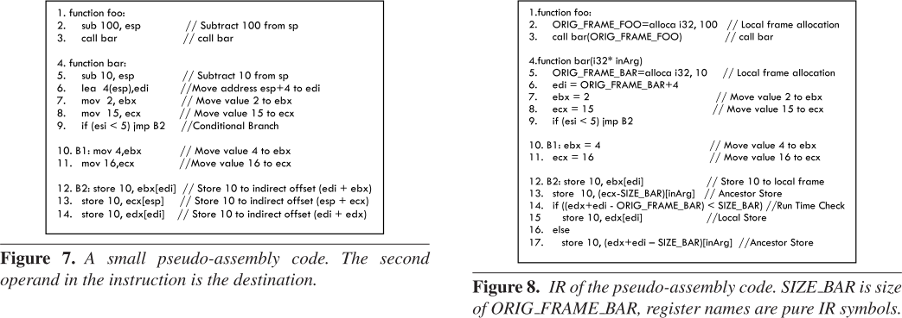
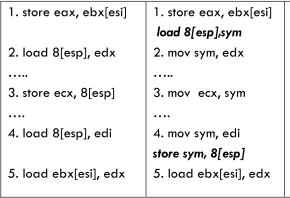

For the source code,

```
int main(){ 
  int z; 
  z = foo(10,20); 
  return z;
} 

int foo(int a, int b) { 
  int temp1; 
  temp1 = a+b; 
  return temp3;
}
```

In the mcsema recovered IR all the 
statck memory acceses are going on a monolithic array r.E 

```
int main(struct regcntx r){ 
  r.RSP = r.RSP-2; //Local Allocation
  
  r.RSP[1] = 20; //Outgoing argument 
  r.RSP[0] = 10; 
  
  int llvm_tmp_3 = rewritten_foo(r); 
  return llvm_tmp3;
}

int rewritten_foo(struct regcntx r) {
  int* llvm_EBP = r.RSP; //Local Frame Pointer
  llvm_RSP = llvm_RSP-10; //Local Allocation

  int tmpIn1 = llvm_EBP[0]; //Incoming Arg 
  int tmpIn2 = llvm_EBP[1];

  int llvm_tmp2 = tmpIn1+tmpIn2; 
  llvm_RSP[2] = llvm_tmp2;

  return llvm_tmp2;
}

```

The first step is localize the monolithic array
to each procedure.

```
int main(struct regcntx r){ 
  int LOCAL_FRAME[MAX_MAIN];
  
  LOCAL_FRAME[0] = 20; //Outgoing argument 
  LOCAL_FRAME[1] = 10; //Outgoing argument 

  int temp1 = LOCAL_FRAME[0];
  int temp2 = LOCAL_FRAME[1];
  
  int temp3 = rewritten_foo(temp1, temp2); 
  return temp3;
}

int rewritten_foo(int arg1, int arg2) {
  int LOCAL_FRAME[MAX_FOO];


  int temp = tmpIn1+tmpIn2; 
  LOCAL_FRAME[0] = temp;

  return temp;
}

```

### Challenges

```
1. function foo: 
2. sub 100, esp             // Subtract 100 from sp
3.  call bar                // call bar

4. function bar: 
5. sub 10, esp              // Subtract 10 from sp
6.  lea 4(esp),edi          //Move address esp+4 to edi
7.  mov 2, ebx              // Move value 2 to ebx
8.  mov 15, ecx             // Move value 15 to ecx
9.  if (esi < 5) jmp B2     //Conditional Branch

10. B1: mov 4,ebx           // Move value 4 to ebx
11. mov 16,ecx              //Move value 16 to ecx
12. B2: store 10, ebx[edi]  // Store 10 to indirect offset (edi + ebx) 
13.  store 10, ecx[esp]     // Store 10 to indirect offset (esp + ecx)
14.  store 10, edx[edi]     // Store 10 to indirect offset (edi + edx)

```



### Symbol promotion


